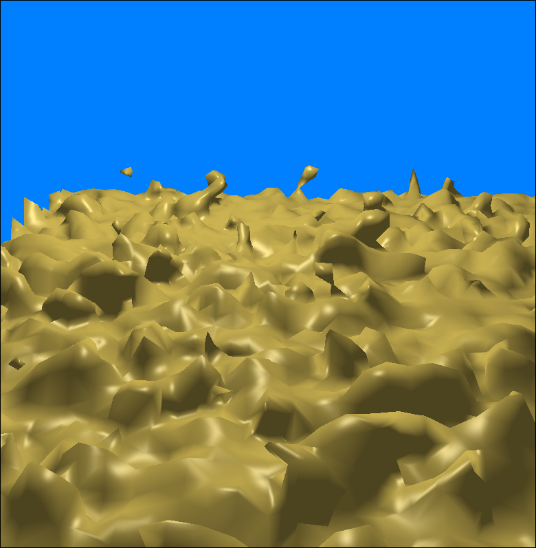
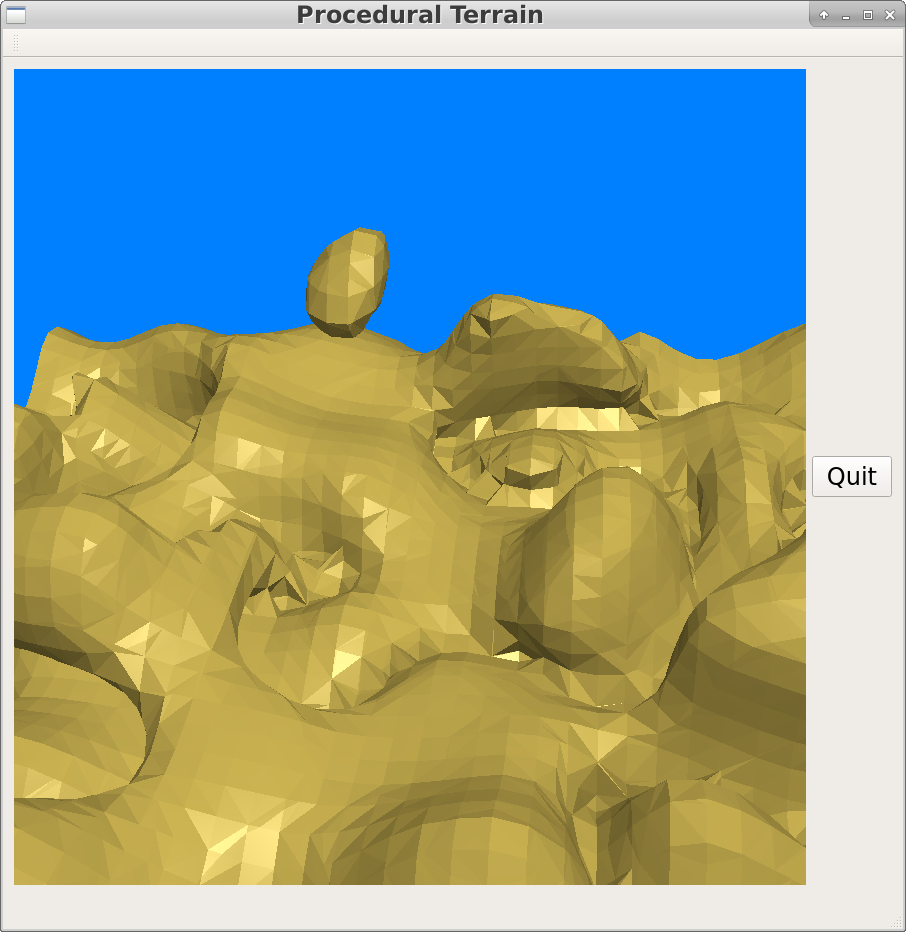
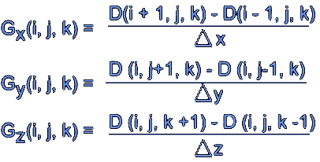
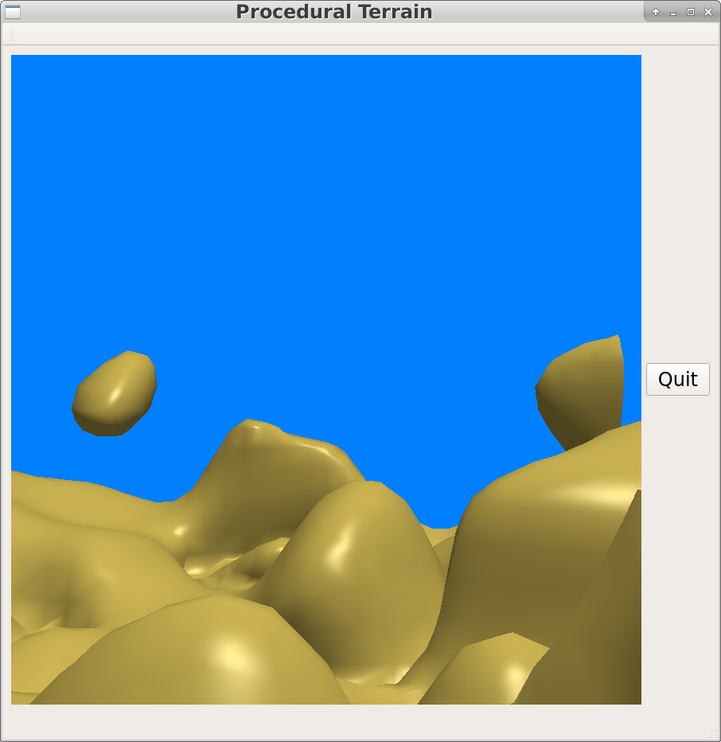

# Procedural Terrain Generation Using the Marching Cubes Algorithm

### *Andrew Conant and Oliver Newman*



## Methods and Tools

To implement the marching cubes algorithm and to render the scene that we
generated, we used only standard C++ OpenGL with vertex and fragment shaders.

We used the GL math library in one of our density functions in order to generate
realistically and interestingly shaped terrain, using the noise functions
included in the GLM library.

## Usage

No external data files or plugins are needed; simply compile and run as follows:

```bash
$ git clone git@github.swarthmore.edu:CS40-F16/final-aconant1-onewman1.git
$ cd final-aconant1-onewman1
$ mkdir build
$ cd build
$ cmake ..
$ make -j8
$ ./terrain {funky|plane|curve} {resolution} {field size} {1|0 (gradient normals?)}
```

{funky|plane|curve} specifies which of the three implemented density functions
to use to generate the mesh geometry.

{resolution} specifies the number of voxels per field side. Each voxel ends up
having side lengths equal to (resolution/fieldsize). Higher resolutions produce
more detailed geometries.

{field size} specifies the "length" of each side of the field. Basically, the
size of the cube that will be divided into voxels.

{1|0 (gradient normals?)} specifies whether gradient or face normals will be
used. Gradient normals are prettier, so we recommend that, but definitely
check out both options.

Some interesting examples:

```bash
$ ./terrain funky 5 100 1
$ ./terrain funky 10 100 1
$ ./terrain funky 20 100 1
$ ./terrain funky 40 100 1
$ ./terrain curve 5 100 1
$ ./terrain curve 10 100 1
$ ./terrain curve 20 100 1
$ ./terrain curve 40 100 1
$ ./terrain plane 5 100 1
```

## Features

### Marching Cubes

The biggest part of our project (both in terms of the time spent implementing
it and extent to which our final product is reliant on it) is the marching
cubes algorithm, which actually allows us to render a graphical representation
of an arbitrary density function. Marching cubes works by dividing the
cube-shaped scene into a three-dimensional grid of cubes (a.k.a. voxels), with
the number of cubes per side specified by the value of `m_res` in
`mypanelopengl.cpp`. For each voxel, the density at each vertex is calculated,
and then the densities are used to determine which edges (if any) cross the
desired isolevel of the density field. In our case, we used an isolevel of 0,
so any edge that has a both positively dense end and a negatively-dense end
intersects the surface. By doing this for every edge, we can unambiguously
represent the geometry that the density function represents within the voxel
as 0 to 5 triangles. In order to compute this quickly, an extensive lookup
table has been precomputed. This mapping from voxels to sets of world-coordinate
points defining
triangles is the overall goal of marching cubes; once this geometry has been
computed, we store it in an array of voxels, and repeatedly draw the voxels.


### Density Functions

We implemented several different density functions to use in the marching
cubes algorithm, which generate different types of terrain. For example,
`plane`
generates a flat plane extending in the *x* and *z* directions. `funky`
generates a somewhat less realistic landscape with some rounded hills and
'floating' chunks of earth. And `curve` represents a sort of bowl-shaped form
(essentially determined by `x*y*z`). Our marching cubes implementation is
capable of rendering any well-defined density function that maps from 3-space
to floating point values. Some density functions are obviously nicer looking
than others, so developing an interesting-looking density function is a bit of
an art. Additionally,

### Lighting

In order to illuminate the terrain using the phong lighting model, normals to
the surface are needed. One way to calculate these normals is to simply take
the cross product of two edges of each triangle to produce what is known as a
"face normal". This vector is perpendicular to the face of the triangle, and
it is assigned to each of the triangle's three vertices. However, as seen below,
it appears crude and angular.



It is obvious where the voxel triangles are, which makes sense because the
normals of two adjacent triangles are not necessarily similar whatsoever. In
order to do better than this, we need the normal to the _isosurface_ itself.
To calculate this, we introduce another element that we need to store:
the gradients of the density function at each corner of each voxel. To
calculate this, we use the following differences and pack the three gradient
components into a vector.



 Then, to find the gradient along each edge that
intersects the isosurface, we apply the same method used to find the point --
linear interpolation using the density values at the ends of the edge, except
now we are interpolating between vertex normals, rather than points. As seen
below, a _much_ smoother lighting can be achieved.


### Movement

Interestingly, the same
effect could be approximated as the resolution approaches infinity, but this
is obviously more space-efficient than that.

Much as in the solar system lab, the user can move about our landscape using
keyboard controls which are printed out when the program begins. The user is
able to pan, zoom, and move about the scene, thanks to the use of a camera
object like the one we used in the solar system lab. Consult the instructions
that are printed at runtime for more detail.

## Further work

We had hoped to be able to apply different textures to our landscape in order
to make it even more realistic by giving the appearance of having grass, rock,
dirt, snow, etc. but implementing and debugging the marching cubes algorithm
proved to be a more daunting task than we had anticipated.

We had also planned to perhaps make landscape that looked as high-definition and
realistic as do the examples in [NVIDIA's procedural terrain
generator](http://http.developer.nvidia.com/GPUGems3/gpugems3_ch01.html) that
we referenced. This would have been more plausible if we had used CUDA to
do march the cubes; since the number of cubes in the scene increases
cubically as the resolution increases, it is a fairly slow process and takes
an obnoxiously long time to run beyond a resolution of 100 or so voxels per
side (which isn't quite enough to get really smooth-looking terrain).

Finally, the terrain is necessarily enclosed in a 3-dimensional cube, but in
some of the examples we referenced, the terrain faded off into the distance
in the background instead of just ending at a cliff over a void. We had hoped
to be able to implement something like this for our project (or perhaps to just
constrain the user's movements so as to make it impossible to get high enough
or close enough to the edge to see the dropoff).


## References
- http://http.developer.nvidia.com/GPUGems3/gpugems3_ch01.html
- http://paulbourke.net/geometry/polygonise/
- www.csee.umbc.edu/~olano/class/635-05-8/MarchingCubes.ppt (gradient calculations)

## Code we Used
- w06-lighting (phong lighting model)
- lab04/05 (QT/OpenGL skeleton and camera functionality)
- http://paulbourke.net/geometry/polygonise/ (lookup tables)
- http://www.icare3d.org/codes-and-projects/codes/opengl_geometry_shader_marching_cubes.html (code inspiration)
- http://flafla2.github.io/2014/08/09/perlinnoise.html (multi-octave Perlin noise)
